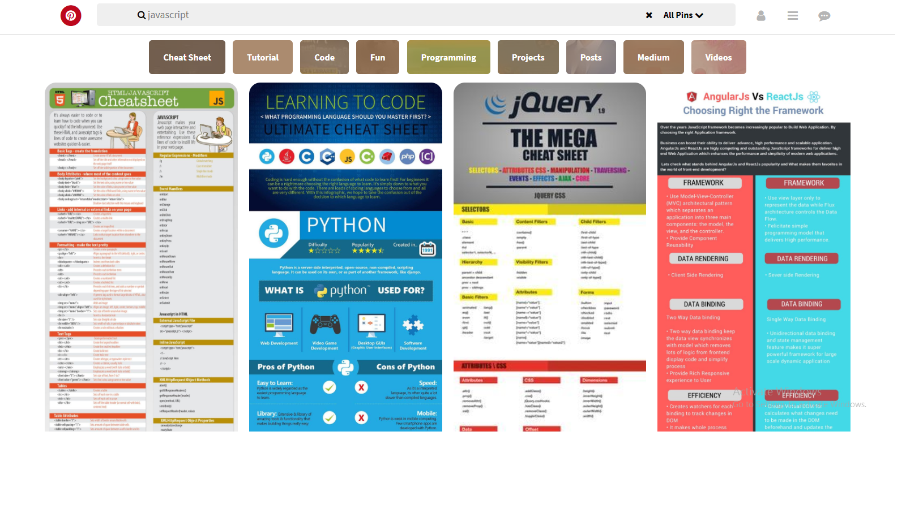

## Pinterest

Realización de la réplica de Pinterest.

### Elementos a utilizar

- Archivo base `index.html` el cual contiene una estructura inicial.

- En la carpeta `css` tendrás un archivo base `main.css` para el estilo del sitio web.

- Carpeta `img`donde estarán los recursos a utilizar:
    * font; para el tipo de fuente.
    * icon; para los íconos de la parte superior

* Vista del documento
